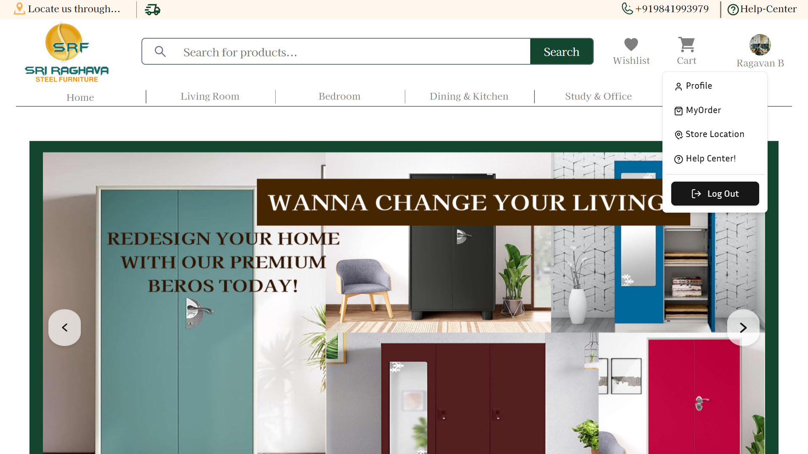
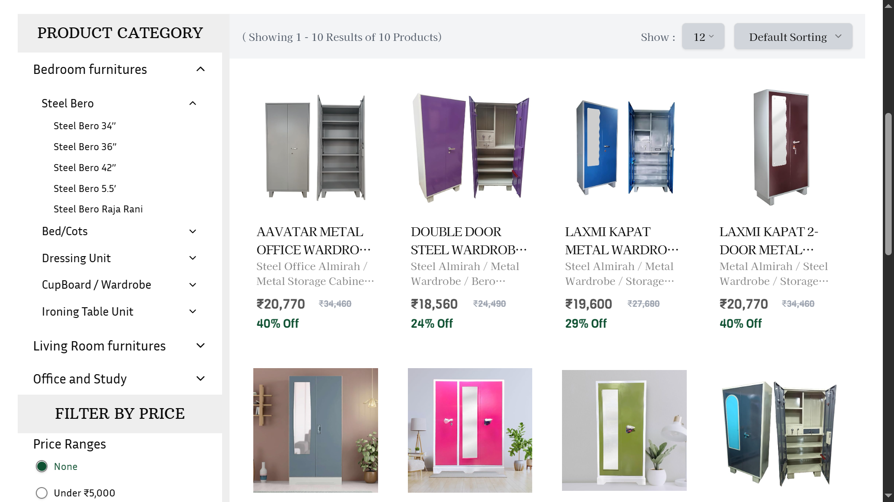
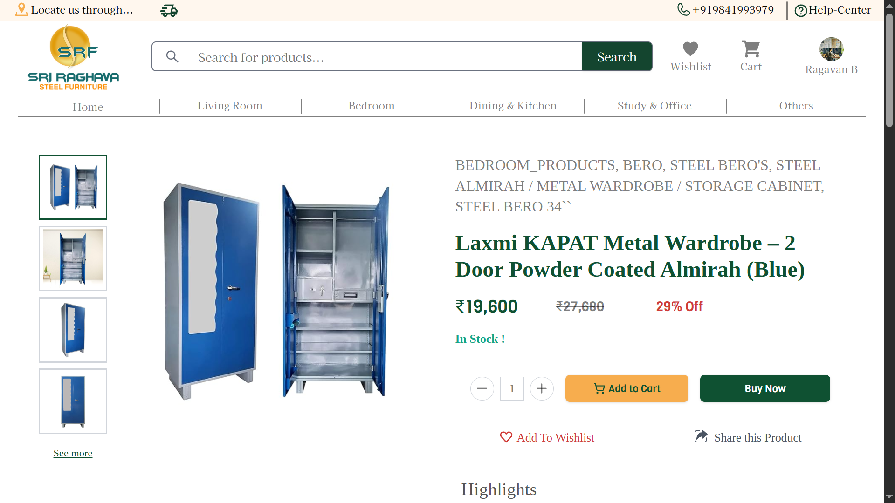
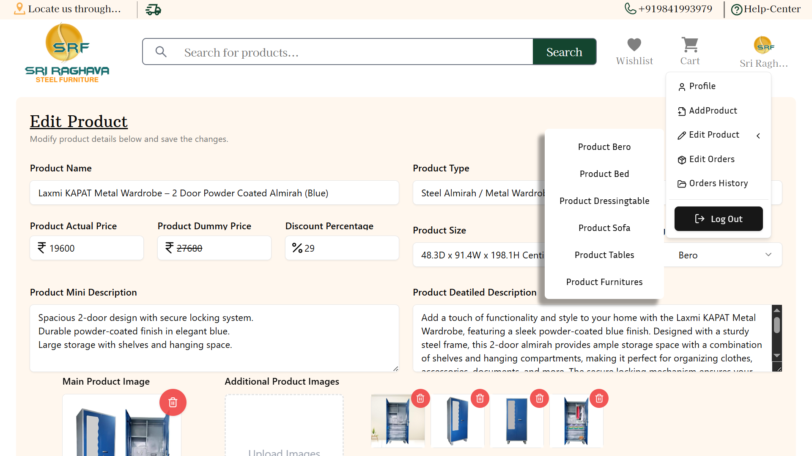

<!-- PROJECT LOGO -->
 

  

  <h1 align="center">Sri Raghava Steel Furniture Store</h1>

  

    A production-grade, full-stack e-commerce platform built for a real-world client in the steel furniture industry.
     
    <strong>⚠️ Source code is private for client confidentiality.</strong>
      
    
    
    
    
    
    
    
    
      
  

---

## 📖 Project Overview

The **Sri Raghava Steel Furniture Store** is a **modern, secure, and highly optimized** e-commerce solution designed for a real-world furniture business specializing in **steel Almirah** and other home/office furniture.

The project is built with the **MERN stack** and uses **TypeScript** on both frontend and backend for improved maintainability. It features a **client-friendly storefront**, **Role Based Access Control**, **admin dashboard**, and **advanced payment & authentication systems**.

---

## ✨ Key Features

- **Full MERN Stack** – MongoDB, Express.js, React.js, Node.js  
- **TypeScript Everywhere** – For type safety & scalability  
- **Responsive UI** – Tailwind CSS + ShadCN UI for modern design  
- **Firebase Phone Authentication** – OTP-based secure login  
- **Auth0 Integration** – Role-based access control  
- **Cloudinary** – Optimized image storage & CDN delivery  
- **Razorpay Payment Gateway** – Secure online payments with webhook verification  
- **MailSendr Notifications** – Automatic email alerts for orders and admin actions  
- **Dockerized Backend** – Backend service packaged as a Docker image  
- **Google Cloud Run Deployment** – Auto-scalable backend hosting  
- **Firebase Hosting for Frontend** – Fast global content delivery  
- **Dynamic Filtering & Sorting** – By price, name, and category  
- **Optimized Performance** – Lazy loading, caching, DB indexing  
- **Admin Dashboard By RBAC** – Manage products, orders, inventory easily  

---

## 🛠️ Tech Stack

| Layer         | Technologies |
|---------------|--------------|
| **Frontend**  | React.js, TypeScript, Vite, Tailwind CSS, ShadCN UI |
| **Backend**   | Node.js, Express.js, TypeScript, Docker |
| **Database**  | MongoDB Atlas |
| **Auth**      | Firebase Phone Auth, Auth0 |
| **Payments**  | Razorpay |
| **Media**     | Cloudinary |
| **Email**     | MailSendr |
| **Hosting**   | Firebase Hosting (Frontend) |
| **Backend Hosting** | Google Cloud Run (Docker Image) |

---

## 📂 Project Architecture

## Frontend
**Tech Stack:** React + TypeScript + Tailwind CSS + ShadCN UI  
- Responsive components & routing  
- Client-side sorting, filtering, and pagination  

## Backend
**Tech Stack:** Node.js + Express + TypeScript + Docker  
- REST APIs for products, orders, and authentication  

## Database
**Tech Stack:** MongoDB Atlas  
- Collections: Products, Orders, Users  

## Cloud Services
- **Firebase Auth** for authentication  
- **Cloudinary** for media storage  
- **Google Cloud Run** for containerized deployment  
- **Razorpay Webhooks** for payment event handling

---

## 🚀 Deployment Workflow

1. **Backend**
   - Dockerized Node.js + Express.js API  
   - Deployed via **Google Cloud Run** for auto-scaling & serverless architecture  
   - Razorpay webhook endpoints hosted in Cloud Run

2. **Frontend**
   - Built with Vite + React + TypeScript  
   - Hosted on **Firebase Hosting** for fast global delivery  

3. **Database**
   - **MongoDB Atlas** cloud database  

---

## 📸 Demo Screenshots

  
   
  <em>🏠 Modern, clean homepage with featured products</em>

  
   
  <em>📂 Category view with dynamic filters & sorting</em>

  
   
  <em>🛒 Detailed product view with optimized images & purchase options</em>

  
   
  <em>⚙️ Admin dashboard for managing products & orders</em>

---

## 📌 Client Confidentiality

⚠️ _The source code is **private** due to client confidentiality._  
This repository is solely for **portfolio showcase purposes**.

---

## 📞 Contact

👨‍💻 **Developer:** Ragavan B  
📍 Chennai, Tamil Nadu, India  
📧 **Email:** [ragav.b369@gmail.com]  
💼 **Portfolio:** [Ragav Portfolio](https://ragavan-developer.netlify.app/)  
🌐 **LinkedIn:** [Ragavan-Developer](https://www.linkedin.com/in/Ragavan-B-developer/)  

